## A terminology for FAIR Stewardship Skills Workshop

## CODATA, Paris, 20-21 May 2019

### **What did we do?**

On 20-21 May 2019, representatives of the research data community met at
the [CODATA](http://www.codata.org/)
headquarters in Paris to take the first steps in building a terminology
to describe
[FAIR](https://www.nature.com/articles/sdata201618)
stewardship skills (the skills necessary to make data FAIR and keep them
FAIR): the tag
[\#terms4FAIRskills](https://twitter.com/search?q=%23terms4FAIRskills&src=tyah)
was used on Twitter during the event.

### **Why is this important?**

There have been a number of efforts to develop training materials and to
list the competencies required for data stewardship. Building on these
previous efforts, the participants of the workshop took the first steps
towards creating a formalised terminology describing competencies,
skills and knowledge associated with activities involved in making data
FAIR. When mature, this will have a variety of use cases, including:

  -  to assist with the creation and assessment of stewardship
     curricula;

  -  to help facilitate the annotation, discovery and evaluation of
     FAIR-enabling materials (e.g. for training) and resources;

  -  to allow the formalisation of job descriptions and CVs with
     recognised competencies.

The completed terminology will be of use to trainers who teach FAIR data
skills, researchers who want to identify skills gaps in their teams and
middle and senior managers who wish to recruit individuals to relevant
roles.

During the workshop we defined [the
methodology](https://drive.google.com/file/d/1mnyIUo1Zx9hUftvkJQnOZlNUnzslezZb/view?usp=sharing)
we will use to build this terminology, and reviewed the use cases (how
this terminology will be used in practice), which had been determined
via a
[survey](https://github.com/hughshanahan/FAIRTerminologySurveyAnalysis).
The use cases will ultimately drive the decision on the type of formal
representation we will iteratively build (i.e. a controlled vocabulary,
a taxonomy, a thesaurus or an ontology). We started the process by
reviewing descriptions of FAIR skills provided by
[FAIR4S](https://eoscpilot.eu/content/d75-strategy-sustainable-development-skills-and-capabilities),
including their derived ‘compound terms’ and definitions, as well as the
related terms and started the process of building simpler terms
(referred to as ‘atomic terms’) from this.

### **What next?**

We will work in groups, collaborating online, to continue to add terms,
decompose them into atomic terms, refine and provide term definitions. A
coordination group will work to clean up and harmonize the list of terms
for consistency. We plan to hold a second workshop in September-November
2019 and - informed by the use cases and competency questions - we will
start to identify and build the necessary formal representation. Before
that workshop, we intend to release some basic documentation about the
work and the draft list of terms and definitions.

### **How to get involved**

We welcome additional collaborators in this activity. If you would like
to become involved with this project or would like some clarification,
please contact the Organizers at
[terms4FAIRskills@codata.org](mailto:terms4FAIRskills@codata.org)
specifying your name, institutional affiliation and the ways in which
you would like to contribute.

### **Who is involved in \#terms4FAIRskills?**

A committee of representatives\* from CODATA, the DCC, DTL/ELIXIR-NL,
FAIRsharing and Royal Holloway organised the 1st workshop which brought
together a number of experts in FAIR data, data skills training and
Knowledge Engineering, from projects and organisations from across
Europe.

## Contributors and Organisers 
(Organisers = \*)

<table>

<thead>
<tr class="header">
<th><strong>Name</strong></th>
<th><strong>Institution</strong></th>
<th><strong>Logo</strong></th>
</tr>
</thead>
<tbody>
<tr class="odd">
<td>Allyson Lister</td>
<td rowspan="4">
FAIRsharing and the University of Oxford, Department of Engineering Science, Oxford, UK
</td>
<td rowspan="4">
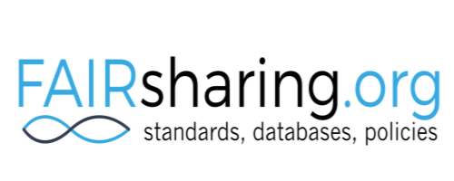
</td>
</tr>
<tr class="even">
<td><strong>* Peter McQuilton</strong></td>
</tr>
<tr class="odd">
<td><strong>* Susanna-Assunta Sansone</strong></td>

</tr>
<tr class="even">
<td>Philippe Rocca-Serra</td>
</tr>
<tr class="odd">
<td><strong>* Angus Whyte</strong></td>
<td rowspan="3">
Digital Curation Centre
</td>
<th rowspan="3">
</th>
</tr>
<tr class="even">
<td><strong>* Kevin Ashley</strong></td>
</tr>
<tr class="odd">
<td><strong>* Sarah Jones</strong></td>
</tr>
<tr class="even">
<td>Catherine Nguyen</td>
<td rowspan="2">INSERM
</td>
<th rowspan="2">
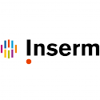
</th>
</tr>
<tr class="odd">
<td>Isabelle Perseil</td>
</tr>
<tr class="even">
<td><strong>* Celia van Gelder</strong></td>
<td rowspan="2">
Dutch Techcentre for LIfe Sciences (DTL), ELIXIR-NL
</td>
<th rowspan="2">
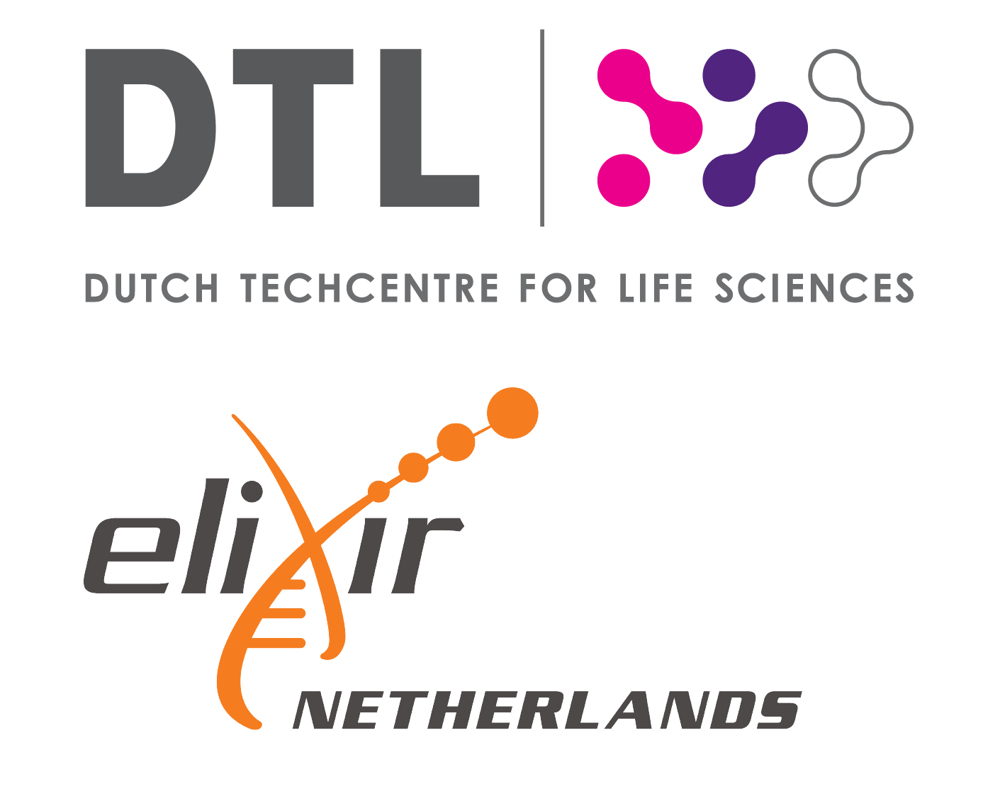
</th>
</tr>
<tr class="odd">
<td>Mateusz Kuzak</td>
</tr>
<tr class="even">
<td>Daniel Bangert</td>
<td>Göttingen State and University Library</td>
<td></td>
</tr>
<tr class="odd">
<td>Frans Huigen</td>
<td>Data Archiving and Networked Services (DANS)</td>
<td>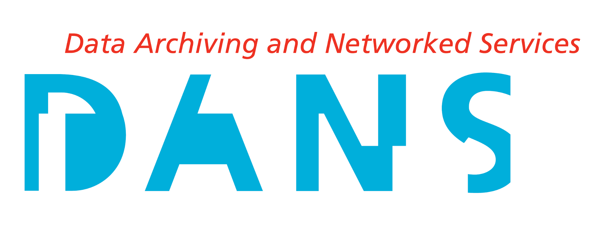</td>
</tr>
<tr class="even">
<td><strong>* Hugh Shanahan</strong></td>
<td>Royal Holloway, University of London</td>
<td>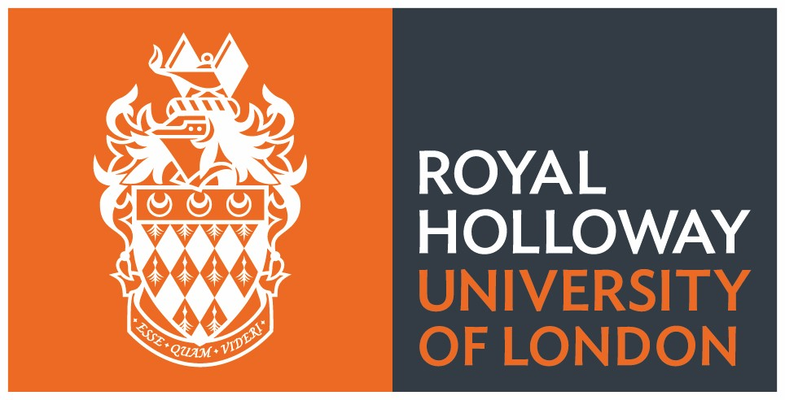</td>
</tr>
<tr class="odd">
<td>Ines Drefs</td>
<td>GO FAIR International Support and Coordination Office</td>
<td></td>
</tr>
<tr class="even">
<td>Kristina Hettne</td>
<td>Leiden University Libraries</td>
<td></td>
</tr>
<tr class="odd">
<td><strong>* Laura Molloy</strong></td>
<td>University of Oxford / CODATA</td>
<td></td>
</tr>
<tr class="even">
<td>Lennart Stoy</td>
<td>European University Association</td>
<td></td>
</tr>
<tr class="odd">
<td>Maria Cruz</td>
<td>VU Amsterdam</td>
<td>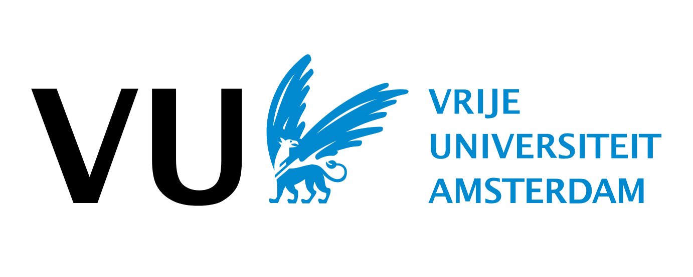</td>
</tr>
<tr class="even">
<td>Melanie Imming</td>
<td>SURF/Imming Impact</td>
<td>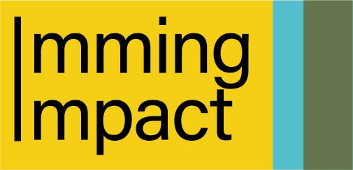</td>
</tr>
<tr class="odd">
<td>Melissa Burke</td>
<td>European Bioinformatics Institute</td>
<td>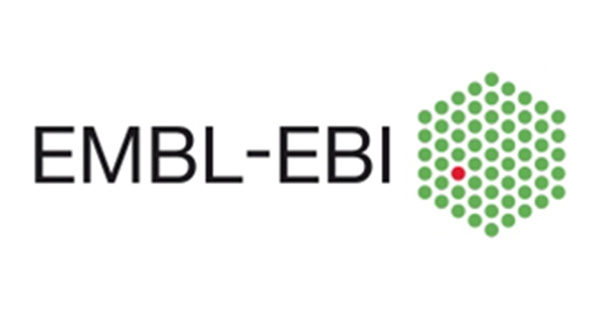</td>
</tr>
<tr class="even">
<td>Natasha Simons</td>
<td>Australian Research Data Commons</td>
<td>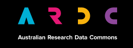</td>
</tr>
<tr class="odd">
<td>Oya Beyan</td>
<td>Digital Repository of Ireland</td>
<td></td>
</tr>
<tr class="even">
<td>Patricia Palagi</td>
<td>SIB Swiss Institute of Bioinformatics, ELIXIR-CH</td>
<td>
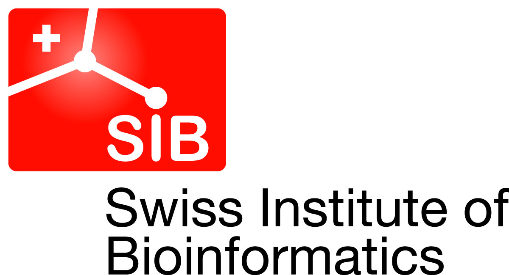

</td>
</tr>
<tr class="odd">
<td><strong>* Simon Hodson</strong></td>
<td>CODATA, the Committee on Data of the International Science Council</td>
<td>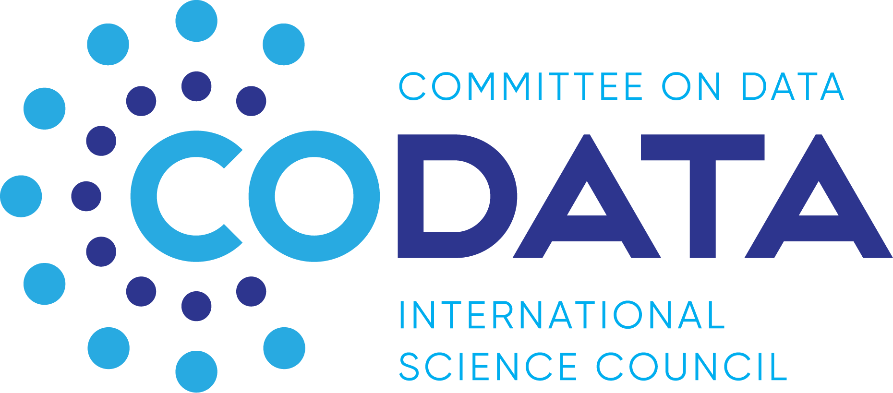</td>
</tr>
<tr class="even">
<td>Victoria Dominguez Del Angel</td>
<td>Institut Français de Bioinformatique(Elixir-FR)</td>
<td>
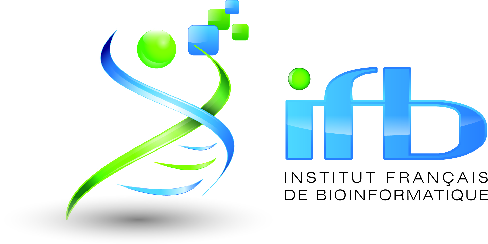

</td>
</tr>
<tr class="odd">
<td>Yan Wang</td>
<td rowspan="2">Delft University of Technology</td>
<td rowspan="2"></td>
</tr>
<tr class="even">
<td>* <strong>Paula Martinez Lavanchy</strong></td>
</tr>
<tr class="odd">
<td>Yann Le Franc</td>
<td>e-Science Data Factory</td>
<td>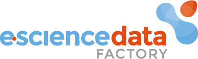</td>
</tr>
</tbody>

</table>

_Document published on May 28 2019._

Back to [Homepage](https://terms4fairskills.github.io/)
