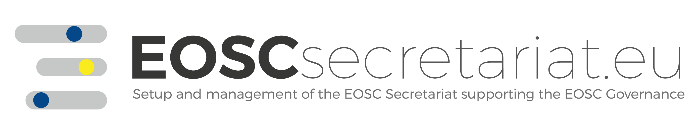

# terms4FAIRskills

Building a terminology for the skills necessary to make data FAIR and to keep it FAIR.

The terms4FAIRskills project aims to create a formalised terminology that describes the competencies, skills and knowledge associated with making and keeping data FAIR. When mature, this terminology will apply to a variety of use cases, including:
- To assist with the creation and assessment of stewardship curricula;
- To facilitate the annotation, discovery and evaluation of FAIR-enabling materials (e.g. training) and resources;
- To enable the formalisation of job descriptions and CVs with recognised, structured competencies.

The completed terminology will be of use to trainers who teach FAIR data skills, researchers who wish to identify skill gaps in their teams and managers who need to recruit individuals to relevant roles.  

---

### Current Status - the EOSC co-creation award July 2020  
  
  

In July 2020, we received notification of our successful application for EOSC co-creation funding to continue this work.  

Thanks to our successful EOSC co-creation proposal, we will continue to develop the FAIR Skills Terminology (FST) with our annotation and coordination groups to create v0.1 of the terminology. We will use a number of real-world use cases to drive this development to ensure a broad and pragmatic initial spread of terms. These terms will be refined via iterative annotation of training materials. Annotation will be performed using the Semaphora tool and will continue until an initial prototype terminology is created.  

Here is a snapshot of our current working model.

**We hope to present a prototype of this terminology in the 1st quarter of 2021.**

In the meantime, progress can be followed here and on our related [terminology repository](https://github.com/terms4fairskills/FAIRterminology).  

 
The EOSC co-creation award funds three people to work on terms4FAIRskills:  

<table>

<thead>
<tr class="header">
<th><strong>Name</strong></th>
<th><strong>Institution</strong></th>
<th><strong>Logo</strong></th>
</tr>
</thead>
<tbody>
<tr class="even">
<td>Yann Le Franc</td>
<td>e-Science Data Factory, France</td>
<td></td>
</tr>
<tr class="odd">
<td>Peter McQuilton</td>
<td>FAIRsharing and the University of Oxford, Department of Engineering Science, Oxford, UK</td>
<td></td>
</tr>
<tr class="even">
<td>Laura Molloy</td>
<td>CODATA, the Committee on Data of the International Science Council</td>
<td></td>
</tr>
</tbody>
</table>

and contributions in kind from the following members of the terms4FAIRskills community:

<table>

<thead>
<tr class="header">
<th><strong>Name</strong></th>
<th><strong>Institution</strong></th>
<th><strong>Logo</strong></th>
</tr>
</thead>
<tbody>
<tr class="even">
<td>Hugh Shanahan</td>
<td>Royal Holloway, University of London</td>
<td></td>
</tr>
<tr class="odd">
<td>Celia van Gelder</td>
<td>Dutch Techcentre for LIfe Sciences (DTL), ELIXIR-NL</td>
<td></td>
</tr>
<tr class="even">
<td>Susanna-Assunta Sansone</td>
<td>FAIRsharing and the University of Oxford, Department of Engineering Science, Oxford, UK</td>
<td></td>
</tr>
<tr class="odd">
<td>Angus Whyte</td>
<td rowspan="2">
Digital Curation Centre
</td>
<th rowspan="2">
</th>
</tr>
<tr class="even">
<td>Kevin Ashley</td>
</tr>
</tbody>
</table>

---

### How We Started and Outreach

terms4FAIRskills sprung out of a community need identified at the GO FAIR Coordination meeting in the January of 2019. Since then, we have hosted two workshops:  

[The first f2f meeting (Paris, FR May 2019)](https://terms4fairskills.github.io/Announcement.html)  

[The second f2f meeting (The Hague, NL October 2019)](https://terms4fairskills.github.io/2ndWorkshopHagueAnnouncement.html)  

We have presented terms4FAIRskills at a number of conferences, including (but not limited to):
- EOSC Symposium November 2019 (Budapest, Hungary)
- FAIRification Mini Symposium (ELIXIR AHM - virtual) June 2020 (see a video of the [ten minute presentation](https://www.youtube.com/watch?v=d21y9glx_fw&feature=youtu.be))
- EOSC Symposium October 2020 (virtual) ([slides](https://drive.google.com/file/d/1mMjMO1mdl1UyL4_X43Tv4wqlJBZnf_YC/view?usp=sharing))
- CODATA/GO-FAIR Convergence December 2020 (virtual) (slides to come)

---

### Organisational Structure

[The terms4FAIRskills Community](https://terms4fairskills.github.io/community.html)  

The terms4FAIRskills project is founded and run by a small group of enthusiasts experts who grasp the significance of this, taken from a variety of backgrounds.  

These include CODATA, ELIXIR-EMBL-EBI, ELIXIR-FR, ELIXIR-NL, ELIXIR-UK, FAIRsFAIR, FAIRsharing, GO-FAIR, the Digital Curation Centre, the Dutch Centre for Life Science, DANS, Royal Holloway, Leiden University Libraries, The British Library, Oxford University, European University Association, VU Amsterdam, SURF, European Bioinformatics Institute, Australian Research Data Commons and TU Delft.  

New collaborators are joining the project all the time. If you are interested in collaborating, please email [terms4FAIRskills@codata.org](mailto:terms4FAIRskills@codata.org) specifying your name, institutional affiliation and how you would like to contribute.  

---

Page updated November 2020. Website maintained by Peter McQuilton.  
