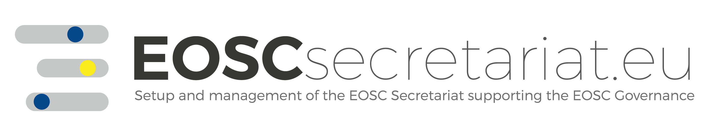

## The terms4FAIRskills community  

### **Coordination Group**  

Provides oversight, governance, strategy and ensures progress. Provides an editorial function to ensure consistency in all terminology drafts that are made public.  

Celia van Gelder (DTL/ELIXIR-NL, NL)  
Simon Hodson (CODATA, FR)  
Yann Le Franc (e-Science Data Factory, FR)  
Peter McQuilton (FAIRsharing/Oxford, UK)  
Susanna-Assunta Sansone (FAIRsharing/Oxford, UK)  
Hugh Shanahan (Royal Holloway, UK)  
Angus Whyte (DCC, UK)  
Laura Molloy (CODATA, FR)  

### **Ontology Maintainers**  
People with ontology-building experience who lead that part of the process.  

Peter McQuilton (FAIRsharing/Oxford, UK)  
Allyson Lister (FAIRsharing/Oxford, UK)  
Yann Le Franc (e-Science Data Factory, FR)  

### **Annotation groups**  
Contributors to the terms and definitions created across the terminology, usually working on a specific section of the terminology, as well as providing annotation and comments on all content.  

### **Capture and Process**  
Frans Huigen  
Laura Molloy  
Lennart Stoy  

### **Integrate and Analyse**  
Melanie Imming  
Hugh Shanahan  
Angus Whyte  

### **Appraise and Preserve**  
Victoria Dominguez Del Angel  
Kristina Hettne  
Yann Le Franc  

### **Advise and Enable**  
Allyson Lister  
Peter McQuilton  
Philippe Rocca-Serra  
Susanna-Assunta Sansone  

### **Expose and Discover**  
Nancy Hoebelheinrich  
Frans Huigen  
Peter McQuilton  
Laura Molloy  
Hugh Shanahan  
Sarah Stewart  

### **Govern and Assess**  
Celia van Gelder  
Mateusz Kuzak  
Yan Wang  
Angus Whyte  

### **Plan and Design; Publish and Release**  
Celia van Gelder  
Mateusz Kuzak  
Yan Wang  

### **Scope and Resource**  
Victoria Dominguez Del Angel  
Kristina Hettne  
Simon Hodson  

### **EOSC co creation core team**  
Those members of the terms4FAIRskills community who are funded to directly work on the terminology.  

Yann Le Franc  
Laura Molloy  
Peter McQuilton  

